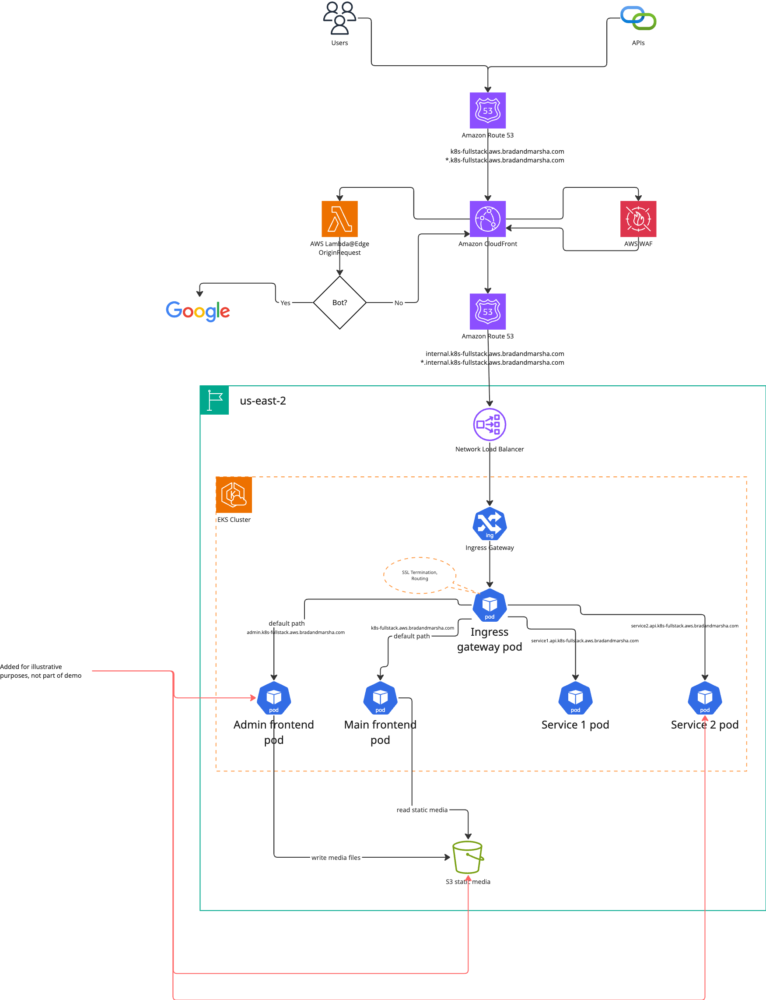

# k8s-fullstack
A sandbox implementation of a full software stack running on kubernetes fronted by Cloudfront protected by WAF

## Layout

## Why does this sandbox exist?
1. Demonstration of running NestJS frontend application as a kubernetes `Deployment` resource
   - Because it is k8s based, it also inherits software delivery via a Docker image
   - Unifies the software delivery model where all software artifacts, except for the edge level processing, is done via the same CICD process
   - Enables frontend applications to use other k8s resources like `Secret` and `ConfigMap` for environment specific configuration to be injected into the running container
1. Demonstration of frontend application using an API application that is a separate kubernetes `Deployment` resource
1. Desire to eliminate S3 objects as a software artifact delivery mechanism
   - S3 has very poor support for installing software artifacts (effectively only using an S3 copy command)
   - Software artifact versioning with S3 is bespoke and not industry standard
   - S3, and the Cloudfront in front of it, provide very limited and basic control over the webserver hosting the content, making a k8s based webserver superior and giving its owners great customization and control over the webserver hosting their content
   - Less duplication of S3 buckets and Cloudfronts to deliver new frontend services
1. Unification of traffic management behind a cluster deployed Gateway service
   - See [Gateway API](https://gateway-api.sigs.k8s.io/) for future details
1. Demonstration of the ability to "plug-in" new http routes on a service by service level
   - This means that a new service can be added, and new http route can be added, with service level k8s manifests
   - Makes routes self service by the application team
1. Demonstration of the ability to centralize Gateway functions
   - Public facing domain management
   - SSL Certificates
1. Demonstration of the ability to centralize Edge processing
   - Bot redirection
   - Edge redirection
